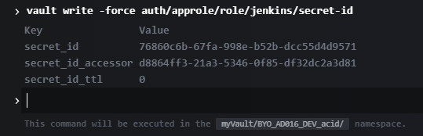

# Automate Secret Injection into CD Workflows with Vault and Jenkins

## Objective

In this section you will learn how to store your secrets using a dedicated Vault namespace of the Cloud Platform **[myVault](https://documentation.cloud.socgen/private/products/security/myvault/index.html)** service. And how retrieve secrets in the CD pipeline.

## Prerequisites

In order to be able to interact with the Cloud Platform **[myVault](https://documentation.cloud.socgen/private/products/security/myvault/index.html)** service, the following prerequisites must be met :

- getting a valid IAM account and its **Account ID**.
  Please visit this [documentation](https://documentation.cloud.socgen/private/products/management/account/index.html) if needed
- being entitled with the following scopes : **myvault:create**, **myvault:read**, **myvault:delete**.
  Please visit this [documentation](https://documentation.cloud.socgen/private/products/security/iam/concepts/product_description.html) if needed

## Scenario

The Cloud Platform **[myVault](https://documentation.cloud.socgen/private/products/security/myvault/index.html)** service let you create a **Vault namespace**. You can create multiple **namespaces** with a given account. Once your **namespace** is created, you interact with the native **Hashicorp Vault API** in order to create/delete/organize your secrets and sensitive data.

- Step 1 : create your namespace.
- Step 2 : enable Key Value secret engine [documentation](https://documentation.cloud.socgen/private/products/security/myvault/howtos/password.html)
- Step 3 : store secrets [documentation](https://documentation.cloud.socgen/private/products/security/myvault/howtos/vault_for_app.html)
- Step 4 : retrieve secrets in CD pipeline
- Step 5 : push secrets into Kubernetes

### Step 1 : create your namespace

This operation is performed using the **[myVault API Swagger](https://myvault.cloud.socgen/)**. [documentation](https://documentation.cloud.socgen/private/products/security/myvault/howtos/create_namespace.html).

### Step 2 : enable Key Value secret engine

Once your namespace is created

- You must create an admin user to access your namespace and to perform administrative operations. This user will have the same rights as the initial generated Vault token. [documentation](https://documentation.cloud.socgen/private/products/security/myvault/howtos/admin.html)
- By default the KV secrets engine is not activated in your namespace. You need to enable it. [documentation](https://documentation.cloud.socgen/private/products/security/myvault/howtos/password.html#3-activate-kv-secret-engine)

### Step 3 : store secrets

Read or write secrets with users. [documentation](https://documentation.cloud.socgen/private/products/security/myvault/howtos/password.html#6-read-or-write-secrets-with-users)

### Step 4 : retrieve secrets in CD pipeline

#### AppRole Authentication

This authentication method allows machines or “apps” to authenticate with Vault-defined roles. An “AppRole” represents a set of Vault policies and login constraints that must be met to receive a token with those policies. The scope can be as narrow or broad as desired. An AppRole can be created for a particular machine, or even a particular user on that machine, or a service spread across machines.
Before logging in, we need to configure [AppRole auth method](https://documentation.cloud.socgen/private/products/security/myvault/howtos/vault_for_app.html#3-activate-approle-auth-method)

#### Create the policy to be used by AppRole

Create a policy named `ro_kv_policy` in `Policies` with the following content (replace the `kv/*` if different):

```
path "kv/*" {
  capabilities = ["read", "list"]
}
```

#### How to create a Role

This operation is performed using your namespace CLI :

- Open your namespace CLI
{.img-fluid tag=1}
- Copy/Paste the following command to create a role named jenkins with read only privileges on the KV secrets engines.

```
vault write auth/approle/role/jenkins token_policies='ro_kv_policy' token_ttl=5m
```

{.img-fluid tag=1}

- Copy/Paste the following command to retrieve the role-id of the role jenkins.

```
vault read auth/approle/role/jenkins/role-id
```

{.img-fluid tag=1}

- Copy/Paste the following command to create a secret-id linked to the role jenkins

```
vault write -force auth/approle/role/jenkins/secret-id
```

{.img-fluid tag=1}

The role-id/secret-id of the jenkins role can be understood as login/password credentials for human identity.

#### Creating Jenkins Credentials

Now we have created the both role-id and secret-id. The next step is to add this in Jenkins :
Go to: Manage Jenkins >> Manage Credentials >> Under Stores scoped to Jenkins, select (global) in the Domains column >> Select Add Credentials in the left pane. Then Select **Username with Password** as kind:

{.img-fluid tag=1}

#### Simple Pipeline to Access Vault Secrets using Vault Agent

##### What is Vault Agent?

Vault Agent is none other than the Vault binary launched in Agent mode. It allows us to benefit from certain functionalities that facilitate our interaction with Vault, in particular :

- [Templating](https://www.vaultproject.io/docs/agent/template): templating is used to transform a source template file into a destination file containing our secrets and takes place once the Vault agent has been started. Templating is based on [Consul Template](https://github.com/hashicorp/consul-template/blob/v0.27.1/docs/templating-language.md).

##### Vault Agent, why ?

In our use case, we want to retrieve the Vault secrets and generate the [Kubernetes secret file](https://kubernetes.io/fr/docs/concepts/configuration/secret/) in the CD pipeline, then push the secret file to the Kubernetes namespace. For this purpose we will use Vault Agent Template as a Jenkins pipeline stage.

{.img-fluid tag=1}

#### Pipeline

##### Example secret-template

Template with Vault Agent requires the use of the secret [function from Consul Template](https://github.com/hashicorp/consul-template/blob/master/docs/templating-language.md#secret). The following is an example of a secret-template Kubernetes that retrieves a generic secret from Vault's KV store:


```
{{ with secret "kv/data/acid/k8s/cm/mysecret" }}
apiVersion: v1
kind: Secret
metadata:
  name: my-secret
type: Opaque
stringData:
  secret1: "{{ .Data.data.key1 }}"
  secret2: "{{ .Data.data.key2 }}"
{{ end }}
```


{.img-fluid tag=1}



```
  secret1: "{{ .Data.data.key1 }}" 
```


key1 must be the key of your secret in vault

##### Jenkins pipeline

Below are some easily examples of a simple Pipeline with checkout and vault agent stage:

{.img-fluid tag=1}

1 : The checkout step will checkout code from source control; scm is a special variable which instructs the checkout step to clone the specific revision which triggered this Pipeline run.

2: Set environment variable VAULT_NAMESPACE wich is the namepace creadted in the previous section.

3: Approle credential created in the previous section.

4: The sh step invokes :

- 'git clone' of sgithub projetct which contains the configuration of the Vault Agent
- Create approle secret.
- Start Vault Agent.

Easily copied and pasted [Pipeline](https://sgithub.fr.world.socgen/raw/dds-itf-acid/vault-agent/master/Jenkinsfile)

### Step 5 : push secrets into Kubernetes

This stage of the Pipeline will deploy your application with the secret file generated in the previous stage:

```
      stage('Deploy') {
        container('kubectl') {
          stage('Deploy on kube9'){
                 withCredentials([file(credentialsId: 'kube-config', variable: 'KUBECONFIG')]){                  
                      echo 'Applying K8s manifests...'
                     sh "kubectl apply -f ./acid/K8S/cm.yaml --namespace ns-${workspace}"
                     sh "kubectl apply -f ./acid/K8S/secret.yaml --namespace ns-${workspace}"
                     sh "kubectl apply -f ./acid/K8S/deployment.yaml --namespace ns-${workspace}"
                     sh "kubectl apply -f ./acid/K8S/svc.yaml --namespace ns-${workspace}"
                     sh "kubectl apply -f ./acid/K8S/ingress.yaml --namespace ns-${workspace}"
                    
            } 
          }
        }
      }

```

📓 Few of the reference are below
------------
