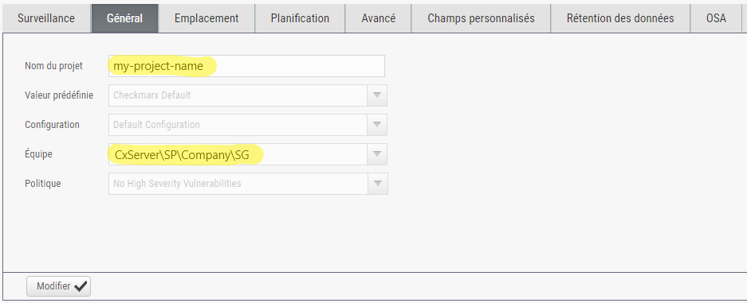

---
hide:
  - toc
---
# Checkmarx Scan

Checkmarx provides static and interactive application security testing (SAST and IAST), software composition analysis (SCA), infrastructure as code security testing (KICS), and application security and training development (Codebashing).

  ```Groovy
  podTemplate(
    inheritFrom: 'jenkins-inbound-agent',
    containers: [
      containerTemplate(name: 'checkmarx-container', image: 'kube9-dtr-dev.fr.world.socgen/byo-ad016-dev-acid/cxcli:2020.4.4', alwaysPullImage: false, ttyEnabled: true, command: 'cat')
    ]
  ){
    node(POD_LABEL) {
      stage('checkmarx scan'){
        container('checkmarx-container') {
          withCredentials([usernamePassword(credentialsId: 'cx-account', usernameVariable: 'USERNAME', passwordVariable: 'PASSWORD')]){
            sh """
            java -jar CxConsolePlugin-CLI.jar Scan -CxServer https://sast-bsc.app.socgen \
              -projectName '<PROJECT-NAME>' \
              -CxUser $USERNAME -CxPassword $PASSWORD -LocationType folder -Locationpath . \
              -Log logs/cx_console.log -SASTMedium 20 -SASTHigh 10 -SASTLow 100
            """
          }
        }
      }
    }
  }
  ```

!!! important
    - `<PROJECT-NAME>` is the combination of `Team` and `Project` names configured in Checkmarx:

      {.img-fluid tag=1}

    🚩 Backslaches must be doubled ex. `myteam\myproject` => `myteam\\myproject`
    
    ```Groovy hl_lines="3"
    sh """
    java -jar CxConsolePlugin-CLI.jar Scan -CxServer https://sast-bsc.app.socgen \
      -projectName 'CxServer\\SP\\Company\\SG\\my-project-name' \
      -CxUser $USERNAME -CxPassword $PASSWORD -LocationType folder -Locationpath . \
      -Log logs/cx_console.log -SASTMedium 20 -SASTHigh 10 -SASTLow 100
    """
    ```
