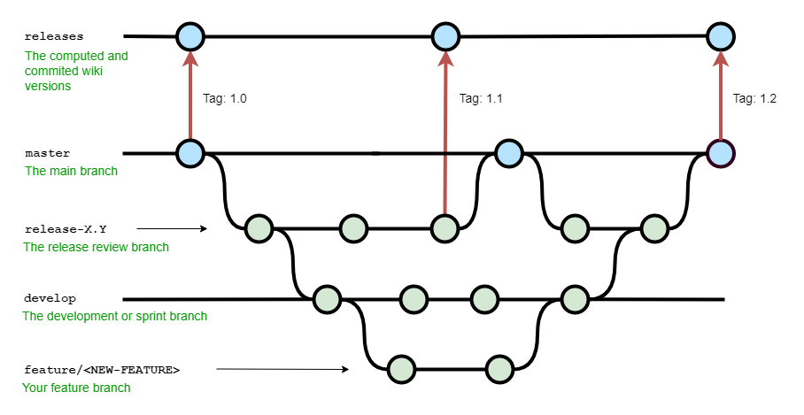

# ACID Wiki Flow, Guidelines and Release process 

## Git Architechture

- `master`: The main branch, used only to create tags and to merge the `release` branch at the end of the release process. It's there to keep track of the wiki source code at every releases.
- `release-X.Y`: this branch is created each time we need to do a new release on the wiki from the `master` branch and is merge into it at the end of the release process once all the changes from the `develop` branch that need to be added are merged into it.
- `develop`: Main development branch of the project. You should start every new features from there.
- `feature/<NEW-FEATURE>`: Each time you want to create a new feature for the wiki, you will have to create a new branch named `feature/<NEW-FEATURE>`.
- `releases`: This branch contains all the mkdoc generated wiki versions and is an orphaned branch. You should never touch it, it's automaticaly updated via the CI process. 

## Git workflow

Here is an overview of the the workflow:

{.img-fluid tag=1}

The `master` 
The `release-X.Y-` branch triggers the release process, running `mike deploy -b releases <TAG> (latest) --update-aliases --push`. This acction is manual and is explained in the section [How to Create a new release](#how-to-create-a-new-release). The pipeline will push the latest commit on the `releases` branch and it's content will be sync onto the **go/acid** s3 bucket (`byo-ad016-dev-acid-wiki`)

The `develop` branch uses a manual pipeline to build the site **without versioning** using the `mkdocs build --clean --strict` command and then deploy it to the **go/acid-dev** s3 bucket (`byo-ad016-dev-acid-wiki-dev`)

The `feature/<NEW-FEATURE>` branches don't have any pipelines to deploy their changes. To test them you can run `mkdocs serve` locally and go to `http://127.0.0.1:8000/`

## How to Create a new release

To create a new release you should:

- Create a new branch named `release-X.Y` from the `master` branch
- Merge the changes you need from the `develop` branch into `release-X.Y`, make sure to only merges the relevent changes you need.
- Update the `changelog` to include all the changes from the precedent version and push it
- Create a new [pull request on Github](https://sgithub.fr.world.socgen/dds-itf-acid/acid-wiki/compare) to add all the changes onto `master`
- Go to the [acid-wiki-create-release](https://cdp-jenkins-paas-byo.fr.world.socgen/job/acid/job/acid-wiki-create-release/) jenkins pipeline and click on `Build with parameters`:
    - In the `RELEASE_VERION`, set the `X.Y` version used in the release to build the relevent version.
    - Keep the `LATEST_CHECK` check if the version you are releasing is the latest one, if not disable it.
- Once the pipeline is done, merge your changes into `master` and tag the `master` branch accordingly.
- Finally merge `release-X.Y` into `develop`

```shell
git checkout master
git tag X.Y
git push origin X.Y
```