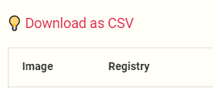

# Resources Notice

## Make a page Wide

To make a page wide just add the page name to the wide_pages lists in the mkdocs.yml file

```yaml
[...]

# Extra config for conditional template rendering 
# and version provider for easy switch
extra:
  version:
    provider: mike
  wide_pages:
    - Docker
    - Report
    - Migration report
    [ extend here ]

[...]
```

## Export to CSV


For this export to work you will need some configuration.
You need to include the following code block before your table and replace the `<EXPORT-NAME>` variable:

```html
<!-- DO NOT REMOVE -->
<div id="exportable-table" data-export-name="<EXPORT-NAME>"> </div>

<!-- Table to export -->
| APP | Entity | Git URL |
| :---: | :---: | :---: |
| Seconds | 301 | 283 |
```

The output should look like this:

{.img-fluid tag=1}

!!! info
    The output file will be named `<EXPORT-NAME>_DD_MM_YYYY.csv`

### Extra Copy button

To add a copy button to your table, just leave the previous collum empty in your table and add `data-extra-copy-btn` to the previous `div` like so:

```html
<div id="exportable-table" data-extra-copy-btn data-export-name="<EXPORT-NAME>" >
</div>
```

## Remote CSV rendering

To allow remote CSV rendering, you need to put your CSV onto an s3 bucket and ally the following CORS, an example can be found [here](https://sgithub.fr.world.socgen/dds-itf-acid/acid-wiki_tables).

```json
{
    "CORSRules": [
        {
            "AllowedOrigins": [
                "*"
            ],
            "AllowedMethods": [
                "GET",
                "HEAD"
            ],
            "AllowedHeaders": [
                "Authorization"
            ],
            "MaxAgeSeconds": 3000
        }
    ]
}
```

Then to load the table simply add the following html div **under** the `exportable-table` one and replace the `data-s3-table-url` value with the link to the csv on your S3 bucket.

```html
<div id="table-url" data-s3-table-url="https://objs3parlow01.fr.world.socgen:4443/byo-ad016-dev-acid-wiki-csv/tables/docker/ACID_docker-base-images-by-acid.csv"></div>
```

### Supported Emoji

At the moment the only 2 supported emojis are ✔️ and ⌛. Since Excel does not like emojis in the CSV we need to map then to a description. To do so edit the `parse_emoji` function in the `docs/assets/javascripts/downloadTablesToCsv.js` file by expanding the replace map as such:

```JS
data = data.replace(regex, function (m) {
    return {
        '✔': 'OK',
        '⌛': 'On going',
        '💡': 'Thinking about it',
        [...]
    }[m];
});
```