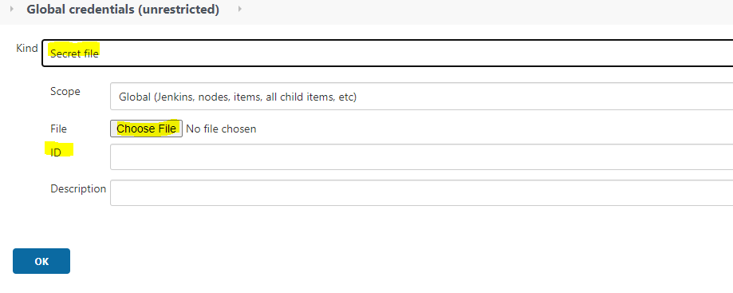

---
hide:
  - toc
---
## Set kubernetes credentials in Jenkins

The UCP bundle ([Get UCP Bundle](ucp.md)) contains the **kube.yml** file that we need to configure the access to kubernetes cluster.
To inject the KUBECONFIG file as secret file credential, you will need to create a Secret File credential that will hold the kube.yml from your UCP bundle zip for your cluster.

Go to: **Manage Jenkins >> Manage Credentials >>** Under **Stores scoped to Jenkins**, select (**global**) in the Domains column **>> Select Add Credentials** in the left panel:

 * Select **Secret file** as a credential type.
 * upload the **kube.yml** in the File filed.
 * Add a unique ID such as **< service-env-kube-config >** to be used later on in the pipeline.

{.img-fluid tag=1}
