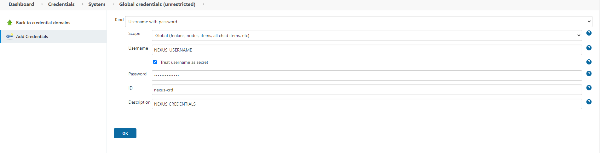

---
hide:
  - toc
---
## Set Jenkins Nexus Credentials

1. First step [Get Nexus Credentials](nexus.md).

2. To be able to inject Nexus credentails to jenkins stages, you have to create a Username with password credential.

Go to: **Manage Jenkins >> Manage Credentials >>** Under **Stores scoped to Jenkins**, select (**global**) in the Domains column **>> Select Add Credentials** in the left panel:

  * Select **Username with password** as a credential type.
  * **Username** is the Nexus username.
  * Add the **Nexus password** in the password field.
  * Add a unique ID such as **< service-env-nexus-crd >** to be used later on in the pipeline.

  {.img-fluid tag=1}
