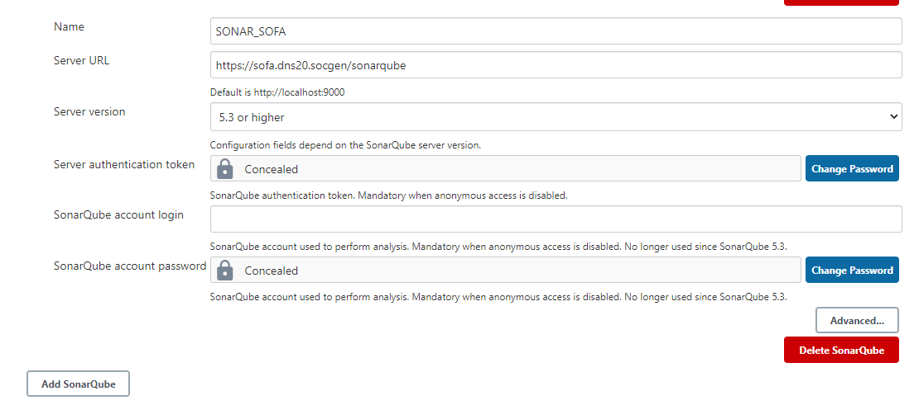
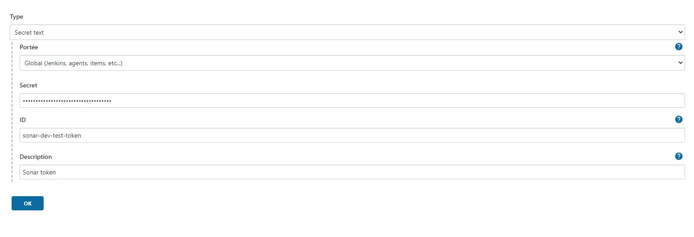

---
hide:
  - toc
---
## Set Jenkins Sonar Credentials

1. First step [Get SONAR Token](sonar.md).

2. Now, let's configure SonarQube access token for the Jenkins plugin:

    In **Manage Jenkins >> Configure System >> SonarQube servers** section **>> SonarQube installations**

    Select **Add SonarQube** and add the following parameters:

    === ":material-file-certificate-outline: Sonar DSP"

        * name: **SONAR_DSP**
        * ServerURL: **https://dsp-sonar.fr.world.socgen/sonar**

        !!! info

            Previousely named Sonar CDP, starting from Saturday, July 9th, at 9 :00 AM (UTC+2) , a major change (Ref : CHG000513524) occured on SonarQube CDP instance.
            The main URL of SonarQube instance `https://cdp-sonar.fr.world.socgen/sonar` have been replaced with `https://dsp-sonar.fr.world.socgen/sonar`

    === ":material-file-certificate-outline: Sonar SOFA"

        * name: **SONAR_SOFA**
        * ServerURL: **https://sofa.dns20.socgen/sonarqube**

    * Server authentication token: the **token** we previously generated.

    {.img-fluid tag=1}

3. Finally, we need to add the sonar credentials 

    To add new credential go to: **Manage Jenkins >> Manage Credentials >>** Under **Stores scoped to Jenkins**, select (**global**) in the Domains column **>> Select Add Credentials** in the left panel:

    {.img-fluid tag=1}

    Sonar credentials must be configured as follows :

    * Select **Secret text** as a credential type
    * **Secret** is the sonar token generated before
    * In the **ID field**, specify a meaningful credential ID value such as **< service-dev-sonar-token >** to be unique in Jenkins.
    * Click **OK** to save the credentials.

    {.img-fluid tag=1}

Now Sonar credentials are ready to be used into our Pipelines.
