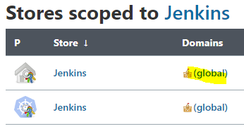
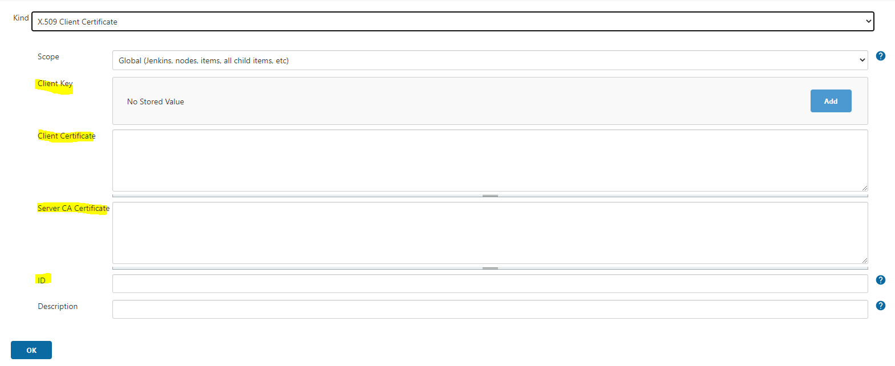

---
hide:
  - toc
---
## Set Jenkins ucp credentials 

If you have retrieved The ucp bundle, will be setting the credentials for the build operation, else check how to do it [Get UCP Bundle](ucp.md).

As previously seen, the bundle content should be like this:

  {.img-fluid tag=1}

To add new credential go to: **Manage Jenkins >> Manage Credentials >>** Under **Stores scoped to Jenkins**, select (**global**) in the Domains column **>> Select Add Credentials** in the left panel:

  {.img-fluid tag=1}

- Configure the UCP bundle as follow :
    * Select **X.509 Client Certificate** as a credential type
    * **Client Key** is the content of the **key.pem** file
    * **Client Certificate** is the content of the **cert.pem** file
    * **Server CA Certificate** is the content of **ca.pem** file
    * In the **ID field**, specify a meaningful credential ID value such as **< service-dev-docker-crd >** for your credentials to become unique in your Jenkins.
    * Click **OK** to save the credentials.

  {.img-fluid tag=1}

Now your credentials are ready to be defined into your Pipeline. 

