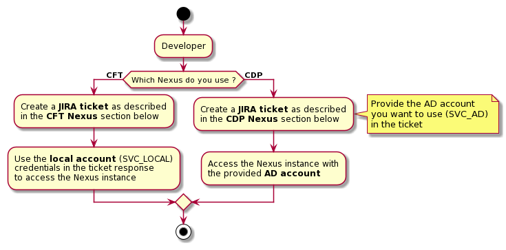

---
hide:
  - toc
---
# Nexus Credentials

There is two ways to get Nexus credentials:

- If you are using a **CFT Nexus**
- If you are using an **CDP Nexus**

<!-- 

PlantUML Source code for futur modification:
//www.plantuml.com/plantuml/png/dPBDIiD04CVlynHpRESHceCD2O9IjFYXbu9iDrEp67V3xgJLjtTdGn4FUZ0GIDZ_n_oMMISnKQRt0Se7h5e-yX16ZXM0E-3YkNUsnnl-c19s0J_3X5DYl5YYzEnnGTHSFX0j0VEpQY8ROJH8T7rrLwCu-yP2X2QxETdezjofr7drOt7FwKIOs8eB7lTvWbC56lYOksRX4AmPq5WR9g-9Y_kdvcLpszIRqcqZT-p5cI6Tm-ToZ9p6u1EhIe8cS4f5eBsgpkZUSWKy92v4xLQ9_WMavZ-0zFL16ADxxMM5snYEhfiPw_QCj_DwpoVZHIVM-owqTRlS-HzmK8QiVqF2avCU4ClHE5TrIFJTH5G1iE_S0V86X17M-IUlmnS0

@startuml
start
:Developer;

if (Which Nexus do you use ?) then (**CFT**)
    :Create a **JIRA ticket** as described
   in the **CFT Nexus** section below;
   :Use the **local account** (SVC_LOCAL)
   credentials in the ticket response
   to access the Nexus instance;
else (**CDP**)
   :Create a **JIRA ticket** as described
   in the **CDP Nexus** section below;
   
   note right: Provide the AD account\nyou want to use (SVC_AD)\nin the ticket

   :Access the Nexus instance with
   the provided **AD account**;
endif

stop
@enduml
 -->

{.img-fluid tag=1}

## CFT Nexus

In the case of an CFT Nexus you will need to create a JIRA ticket and provide the following informations:

- BU
- Trigram
- IRT
- Project name
- Team name
- Email referent

Then the SOFA team will send you back the followings informations:

- The user created by SOFA will be : `team_IRT`
- The user will be link to the role `jenkins_cdp_team`
- The user will be created and password send by **security email** to **referent email**, to change after receiving.

## CDP Nexus

In the case of an CDP Nexus you will need to create a JIRA ticket and provide the AD account you will use as the Nexus service account.

Then you can go on **[go/cdp](https://go/cdp) >> Get Support >> Nexus >> Create repository** and manage your instance.

> // TODO Add ticket Example + link
