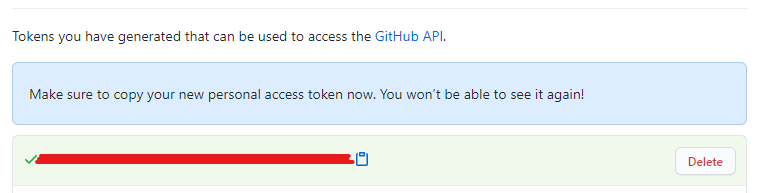

---
hide:
  - toc
---
# Creating a Git Personal Access Token

!!! note
    Please note that Personal Access Token can be created for a user or SERVICE ACCOUNT.

    It is strongly recommended to use a SERVICE ACCOUNT for automated scenarios.

1. In the upper-right corner of user **Git** page, click your profile photo, then click **Settings**.

    {.img-fluid tag=1}
   
2. In the left sidebar, click **Developer settings**.

    {.img-fluid tag=1}

3. In the left sidebar, click **Personal access tokens**.

    {.img-fluid tag=1}

4. Click **Generate new token**. 

    {.img-fluid tag=1}

5. Give your token a descriptive name and select the scopes, or permissions, you'd like to grant this token. 

    {.img-fluid tag=1}

6. You must select the minimum scopes/rights required and click **Generate token**

    {.img-fluid tag=1}

7. Copy the token to your clipboard and save it somewhere safe.

    {.img-fluid tag=1}

The next step is to add the git token as jenkins credential [Set Jenkins Git Credentials](jenkins_git.md).

It will allows us to clone git private projects within the pipeline.