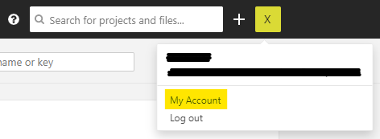
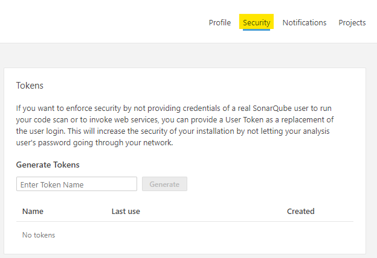
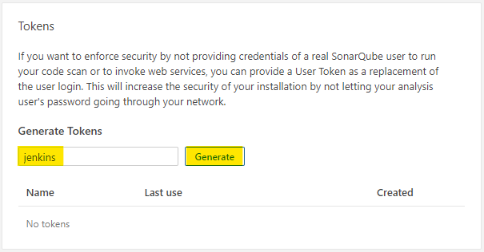
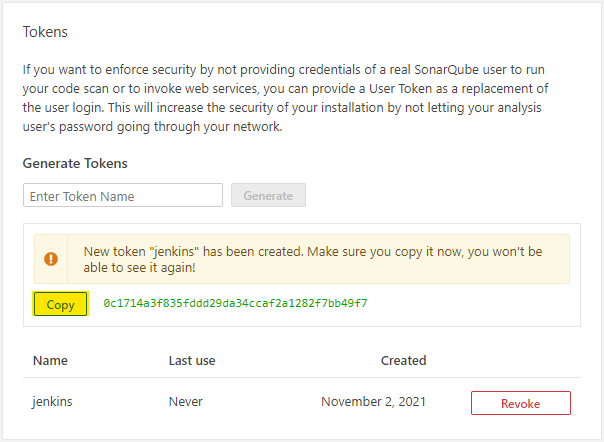

---
hide:
  - toc
---
# Setup Sonar for Jenkins

1. First of all, connect to Sonar with a user or a SERVICE ACCOUNT.

    !!! note
        Please, note that it's adviced to use a SERVICE ACCOUNT for the purpose.

        The SERVICE ACCOUNT owner of the token must have the `"Browse"`, `"See Source Code"` and `"Execute Analysis"` permissions on the scanned project.

2. On the upper right hand corner for account details and click on **My Account**

    {.img-fluid tag=1}

3. Click on **Security**

    {.img-fluid tag=1}

4. Enter a token name (ex. jenkins-`app_name`)

    {.img-fluid tag=1}

5. Copy & Save somewhere safe the secret token

    {.img-fluid tag=1}

The token will be added in Jenkins as a credential [Set Jenkins Sonar](jenkins_sonar.md).

Its purpose is to run analyses or invoke web services without access to the user's actual credentials.