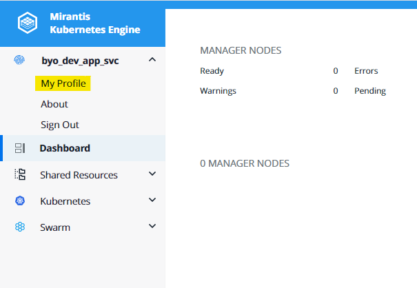
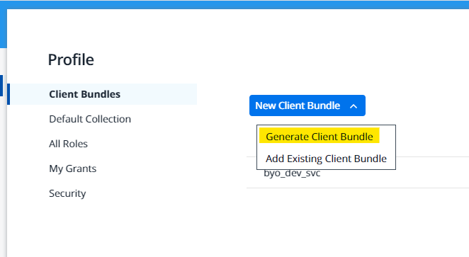
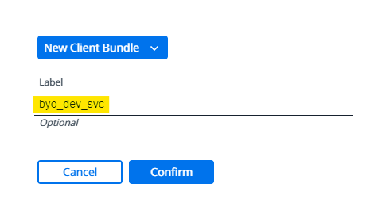
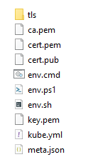

---
hide:
  - toc
---
# Setup Access for Docker EE

The [UCP](https://kube9-dev.fr.world.socgen) (universal control plane)  is accessible via a web UI to deploy, configure, manage, and monitor your applications within kubernetes clusters.

To authenticate to the build and deployment clusters we need to generate the client certificates that we can download from the SERVICE ACCOUNT UCP profile page.

!!! note
    Please note that a user or SERVICE ACCOUNT attached to an AD Group can connect to Kubernetes cluster.

    As best practice, use a SERVICE ACCOUNT to connect to Docker EE UI.

1. Click on account name on the top left hand corner and go to **My Profile**.

    {.img-fluid tag=1}

2. Click on **New client bundle** and then choose **Generate client bundle**.

    {.img-fluid tag=1}

3. Enter a label for the bundle and click **Confirm**.

    {.img-fluid tag=1}

4. Unzip the download file, here is it's content:

    {.img-fluid tag=1}

Now, we have everything we need to launch build and deployment on Kubernetes.

We can move to the next step to define these credentials within jenkins [Set UCP Bundle for CI/CD in Jenkins](jenkins_ucp.md).