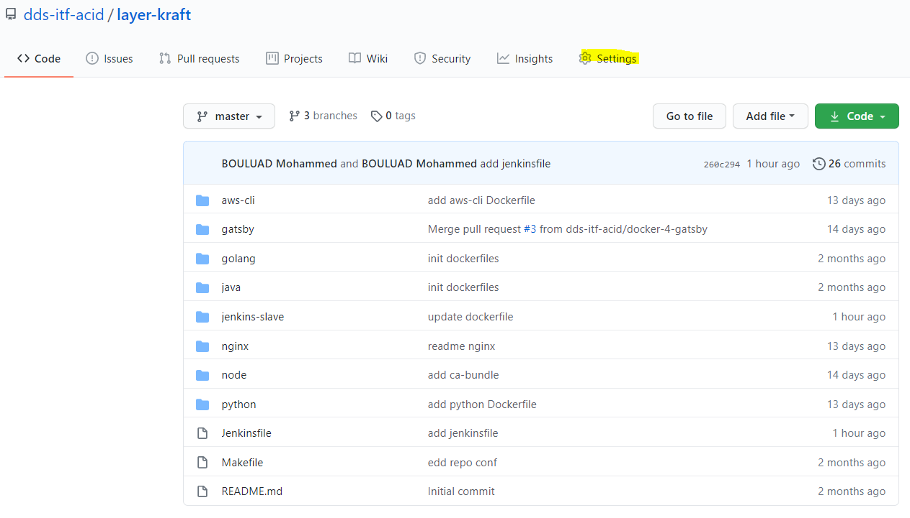
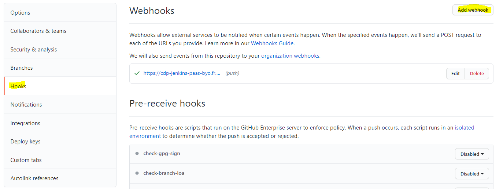
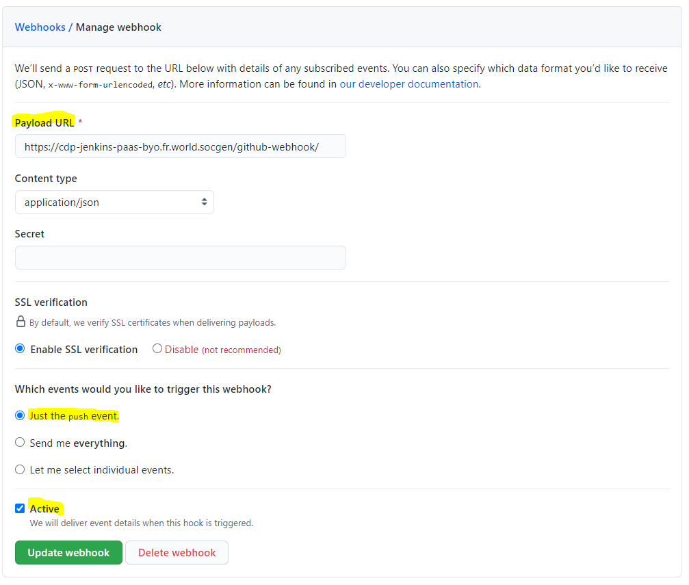
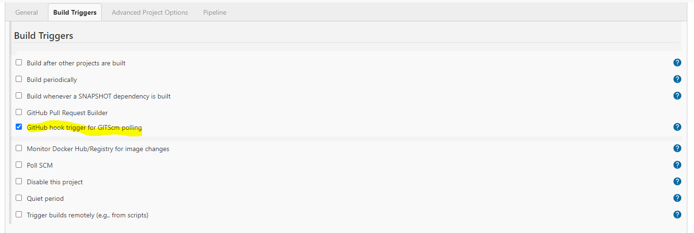

---
hide:
  - toc
---
# Automatically triggering a Jenkins job on every Code Push Event

Objective of this section is to explain how you can automatically run a Jenkins job on every code push using Webhooks.

First of all, a webhook is an HTTP callback, an HTTP POST that occurs when something happens through a simple event-notification via HTTP POST.

GitHub webhooks in Jenkins are used to trigger the job whenever a developer commits something to the master branch.

1. Go to your sgithub repository and click on **Settings**:

    {.img-fluid tag=1}

2. Click on Hooks and then click on **Add webhook**:

    {.img-fluid tag=1}

3. In the Payload URL field, paste your Jenkins URL and at the end of the URL add _/github-webhook/_.

    Then select option Just the push event as the trigger point for this webhook and check Active option so that event details will be delivered when this hook is triggered:

    {.img-fluid tag=1}

4. In Jenkins Job configuration -> Select GitHub hook trigger for GITScm polling option under Build Triggers as we want to trigger the job on every code push event:

    {.img-fluid tag=1}

!!! tip
    The job has to be executed manually one time in order for the push trigger and the git repo to be registered, so the webhook can work properly.