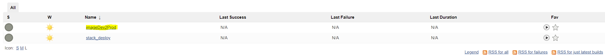
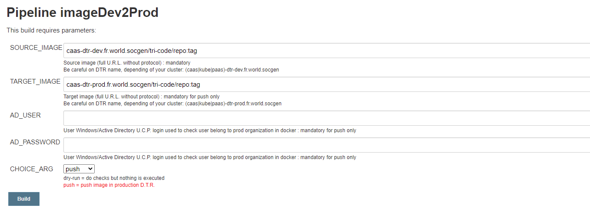
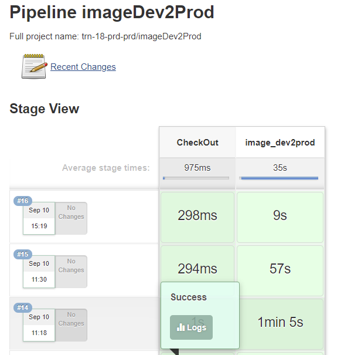
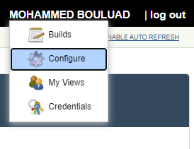
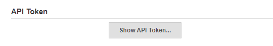
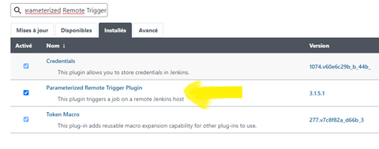
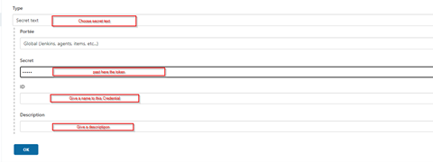
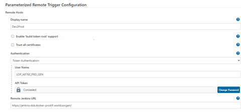

# Promote to production environment

In order to respect SG security requirements regarding network segregation, the Orchestrated Containers offer, deploys Kubernetes clusters on production Networks with enforced security policies.
Users can not push directly their Docker images into the production registry. This operation needs to run a process called "dev2prod" in order to pass some security checks:

* CVE vulnerabilities image scanning
* Compliance checks (non root user, privileges escalation, non authorized images, etc...)

## Using Jenkins Web UI

1. Login to the [Jenkins](https://jenkins-dck.docker-prod.fr.world.socgen/) UI using your Windows credentials:
when you created your production Namespace, you will find your folder (_https://jenkins-dck.docker-prod.fr.world.socgen/job/<your_workspace_name>_) inside DCK Jenkins.
2. Click on the **run icon**

    {.img-fluid tag=1}

3. Fill in the form as shown below and submit

    {.img-fluid tag=1}

    * `SOURCE_IMAGE`: is your dev/staging image
    * `TARGET_IMAGE`: is the future name of your production image
    * `AD_USER / AD_PASSWORD`: is your windows credentials

4. Check the status 

    {.img-fluid tag=1}

## Using ACID script

1. Clone the [Git repository](https://sgithub.fr.world.socgen/dds-itf-acid/Dev/blob/master/Promote/promote.sh)

2. Execute the command:

    ```bash
    ./promote.sh <ad login> <password> <prod workspace> <source image> <target image> 
    ```

3. Check the status

## Using Jenkins plugin (Parameterized Remote Trigger)

1. Connect with the AD generic account to your [Jenkins dev2prod](https://jenkins-dck.docker-prod.fr.world.socgen) pipeline and generate a token:

    * Go under the account name and select configurer

    {.img-fluid tag=1}

    * Under Api token

    {.img-fluid tag=1}
    
    * Copy the token

2. Go on your own Jenkins

    * Go on Manage Jenkins and verify If Parameterized Remote Trigger plugin  is not installed, install it before:

    {.img-fluid tag=1}


3. Create a credentiel with secret text format

    {.img-fluid tag=1}

4. Configure the remote Jenkins

    {.img-fluid tag=1}


5. Add a stage in your production CD  Jenkinsfile:

??? abstract "Stage"

    ```groovy
        stage('Push on Prod DTR'){
                withCredentials([usernamePassword(credentialsId: 'IDJenkins', passwordVariable: 'AD_PASSWORD', usernameVariable: 'AD_USER')]){
                    def handle = triggerRemoteJob(
                        remoteJenkinsName: 'Dev2Prod',
                        job: "${WORKSPACE_PRD}/imageDev2Prod",
                        parameters: "AD_USER=$AD_USER\nAD_PASSWORD=$AD_PASSWORD\nCHOICE_ARG=push\nSOURCE_IMAGE=${DTR_HP}/${WORKSPACE_HP}/${image_name_hp}:${image_tag_hp}\nTARGET_IMAGE=${DTR_PRD}/${WORKSPACE_PRD}/${image_name_prd}:${image_tag_prd}",
                        blockBuildUntilComplete: true
                    )
                }
        }

    ```

    !!! tip
        workspace = 'YOUR_WORKSPACE' <br>
        namespace = "ns-${workspace}" <br>
        DTR_HP = 'kube9-dtr-dev.fr.world.socgen' <br>
        DTR_PRD = 'kube9-dtr-prod.fr.world.socgen' <br>
        WORKSPACE_HP = 'YOUR_WORKSPACE_DEV' <br>
        WORKSPACE_PRD = ' YOUR_WORKSPACE_DEV ' <br>
        image_name_hp = 'YOUR_IMAGE_NAME_DEV' <br>
        image_name_prd = 'a YOUR_IMAGE_NAME_PROD' <br>
        image_tag_hp = 'YOUR_TAG_DEV' <br>
        image_tag_prd = 'YOUR_TAG_PRD' <br>
