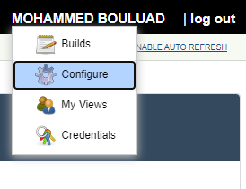

# Jenkins Configuration as Code

JCasC provides the convenience and flexibility of configuring pipelines without using the UI.

## Diving into CasC scripts

Inside the `acid` folder we have put manifests in CI and CD folders to configure and manage Jenkins through Job DSL plugin.

The Job DSL plugin provides an extension to run Job DSL scripts when configuring Jenkins using Configuration as Code (casc).

=== ":material-sync-circle: CI Pipeline"

    ??? abstract "CI Job naming convention"

        The CI pipeline **must** follow the following naming convention:
        
        `<SERVICE-NAME>`

    ```groovy
    jobs:
      - script: >
          folder('ACID')                                                                           # Name of the Jenkins folder to use (will be created if new)
      - script: >
          pipelineJob('ACID/<SERVICE-NAME>') {                                                     # Name of the job to be created or reconfigured
            parameters {                                                                           # Parameters needed for the pipeline
                stringParam("CA_CERT", "/usr/unipass-server.pem", "Unipass certificate location")
                stringParam("S3_ENDPOINT", "https://objs3parlow01.fr.world.socgen:4443", "S3 endpoint")
                stringParam("S3_BUCKET", "xxx-xxxxx-dev-acid", "S3 bucket name")
            }
            definition {
              cpsScm {
                scriptPath 'acid/CI/Jenkinsfile'                                                   # Path to Jenkins file to be used in the git repository
                lightweight true
                scm {
                  git {
                    remote {
                        url 'https://sgithub.fr.world.socgen/dds-itf-acid/acid-api.git'            # Repository url of the project
                    }
                    branch '*/$BRANCH'
                    extensions {}
                  }
                }
              }
            }
          }
    ```

=== ":material-rocket: CD Pipeline"

    ??? abstract "CD Job naming convention"

        The CI pipeline **must** follow the following naming convention:
        
        `<SERVICE-NAME>-CD`

    ```groovy
    jobs:
      - script: >
          folder('ACID')
      - script: >
          pipelineJob('ACID/<SERVICE-NAME>-CD') {
            parameters {
              stringParam("image_tag", "", "The image tag to be used for deployment") # Parameters needed for the CD pipeline
            }
            definition {
              cpsScm {
                ...
              }
            }
          }
    ```

## Using Configuration as Code scripts

### Jenkins UI
Follow these steps to create a job using the DSL script "jenkins-casc.yml" for CI & CD on your Jenkins:

1. Go to "Manage Jenkins" in your Jenkins Dashboard:

    {.img-fluid tag=1}

2. Choose "Configuration as Code" in System configuration group:

    {.img-fluid tag=1}

3. Enter the raw url of "jenkins-casc.yaml" from your repo:

    The url must have this format => https://sgithub.fr.world.socgen/**raw**/dds-itf-acid/acid-api/master/acid/CI/jenkins-casc.yaml

    {.img-fluid tag=1}

4. Click "Apply new Configuration" & enjoy.

    * We can find newly created `ACID` Folder in Jenkins dashboard:
    {.img-fluid tag=1}

    * The `acid-api` job created inside ACID Folder:
    {.img-fluid tag=1}

### Jenkins API

1. Connect with the AD generic account to your Jenkins and generate a token:

    * Go under the account name and select configurer

    {.img-fluid tag=1}

    * Under Api token

    {.img-fluid tag=1}
    
    * Copy the token

2. Prepare the POST payload:

    ```Groovy
    {"newSource": "https://sgithub.fr.world.socgen/raw/<EXAMPLE>/jenkins-casc.yaml"}
    ```

3. Prepare the API call:
 
    ```Groovy
    curl -X POST --user USER:TOKEN -d @payload https://<JENKINS_URL>/configuration-as-code/replace
    ```
