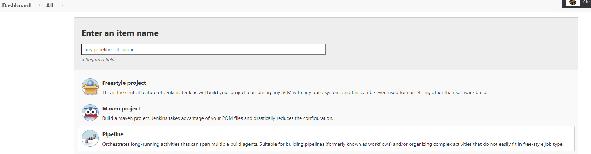
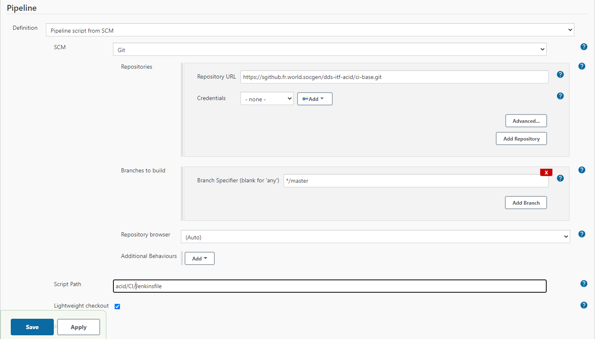
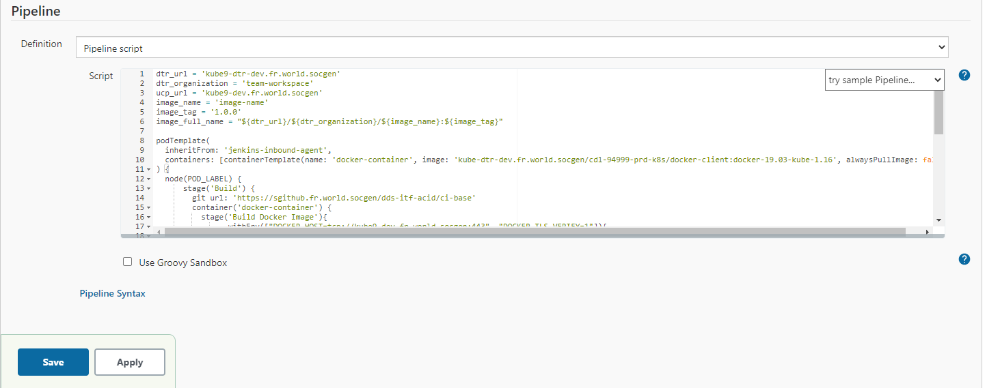

## Through the classic UI

1. From the Jenkins home page, click **New Item** at the top left.

    {.img-fluid tag=1}

2. Provide _my-pipeline-job-name_ as the name for the job and select the **Pipeline ** as the type then click **OK**.
3. Defining Jenkinsfile source with 2 ways:
    * Add a Git source and provide the repository link (like: https://sgithub.fr.world.socgen/dds-itf-acid/ci-base.git).
    
        {.img-fluid tag=1}

    * Copy/Paste the content of [ACID Jenkinsfile](https://sgithub.fr.world.socgen/dds-itf-acid/ci-base/blob/master/Jenkinsfile) in the Script section: 

        {.img-fluid tag=1}

## Through API

// soon ...

## Through Jenkins configuration as code plugin

To add the pipeline as configuration as code, you can check this page [jenkins_casc](jcasc.md).