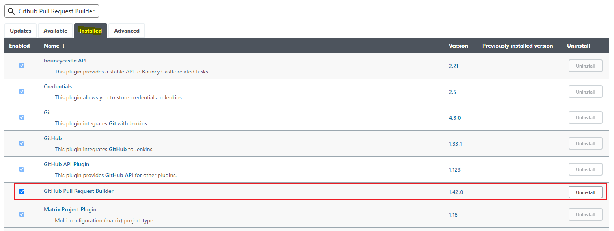
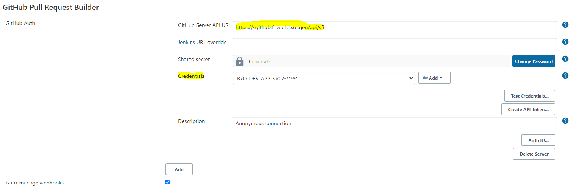
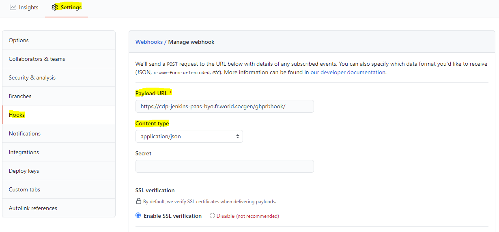
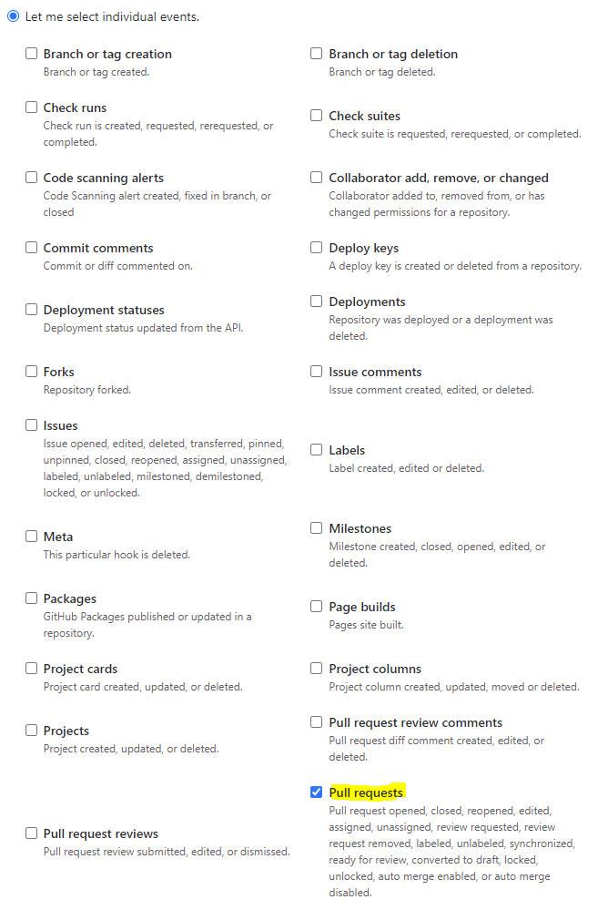
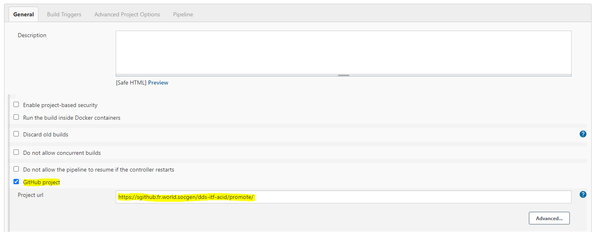
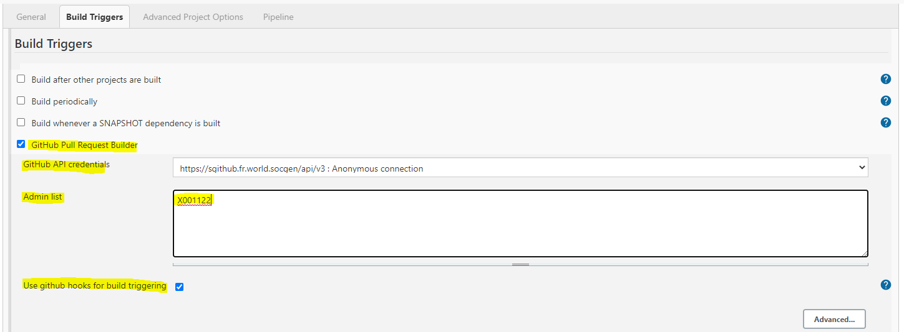

# Run a Jenkins Job on Github Pull Request

The purpose of this section is to explain step-by-step how to automate the build trigger on Jenkins using the Github Pull Request Builder plugin.

## Download Github Pull Request Builder Plugin (if it doesn't exist)

1. Go to manage Jenkins –> manage plugins

2. Click on the available tab at the top and search for 'github pull request builder'. Select the plugin using the checkbox and click

3. Install without restart as shown in the image below

4. Once the plugin is install ,select the restart checkbox as shows in the image below.

      {.img-fluid tag=1}

## Configure Github Pull Request Builder

Once the plugin is installed, we will configure the plugin with github account as shown in the steps below:

1. Go to Manage Jenkins –> Configure System

2. Look for Github Pull Request Builder Section

3. Click on Add button and add credentials for sgithub account. Once added, change _GitHub Server API URL_ with : 
      https://sgithub.fr.world.socgen/api/v3

4. Then select the credentials from drop-down as highlighted in below image. You can click on Test Crdentials to test if credentials are working fine -> Click on Save

      {.img-fluid tag=1}

## Configure Github Repository Webhook

Jenkins will receive Pull-Request (PR) events through sgithub webhooks. Whenever a PR is raised, the github webhooks will come into action.

1. Go to Github repository –> Settings –> Webhooks –> Add Webhook

2. Enter Jenkins url in the format –> https://YOUR_JENKINS_URL/ghprbhook/

3. Change Content type to application/json

      {.img-fluid tag=1}

4. From “Let me select individual” section, select pull requests

      {.img-fluid tag=1}

5. Save/Add the webhook

6. Once saved, you will see a green tick if webhook is successful

## Configure Jenkins Job to Run on Pull Request

After creating webhook, we need to configure the job which will be triggered when a PR will be raised on sgithub.

1. In General tab of your job, tick the checkbox of Github project and enter the url of the sgithub repository

      {.img-fluid tag=1}

2. Under Build Trigger, tick Github Pull Request Builder

3. Tick Use github hooks for build triggering

      {.img-fluid tag=1}

4. Once all above configurations are done, click on Save

!!! done
    This is all for the setup, now simply raise a PR on your sgithub repository. As soon as the PR is raised, sgithub will trigger a webhook to Jenkins and Jenkins will start building the Jenkins job.