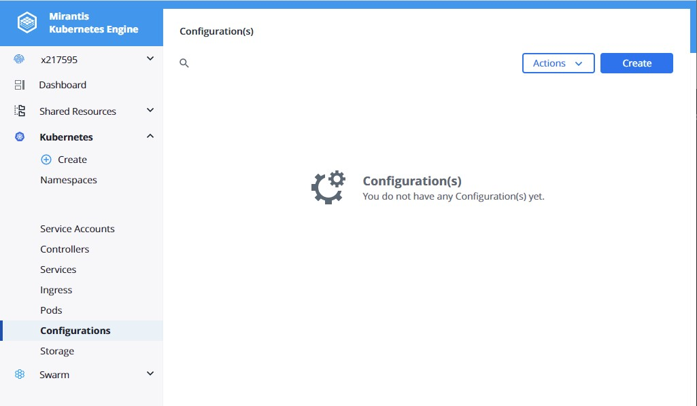
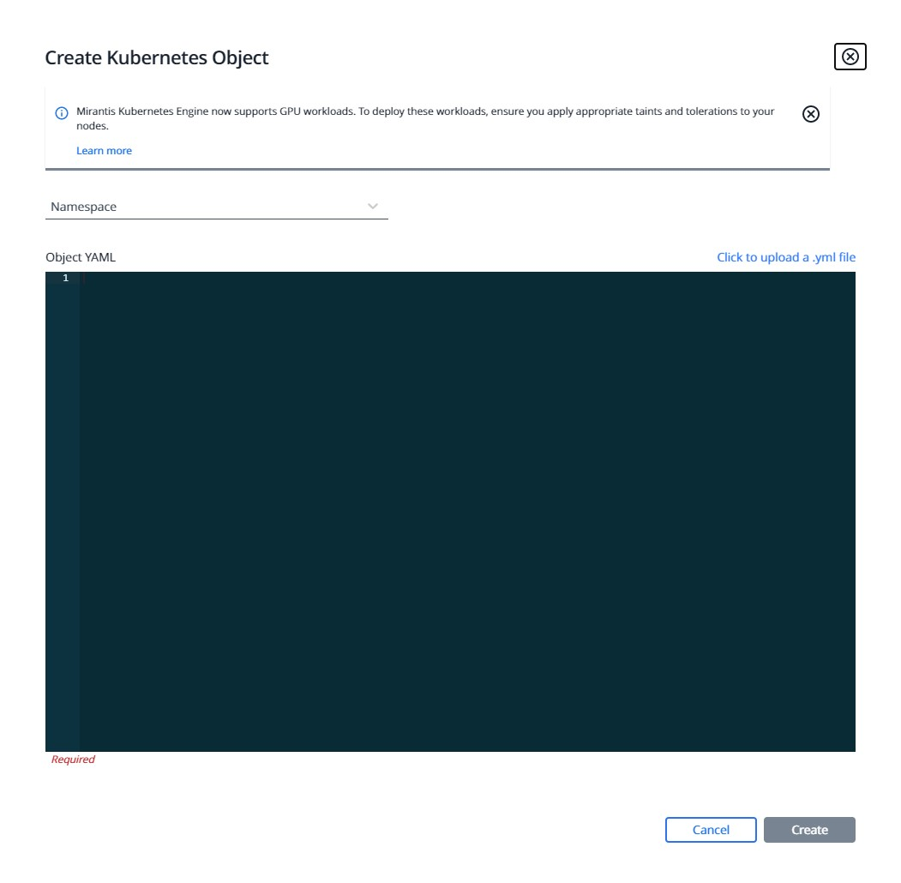
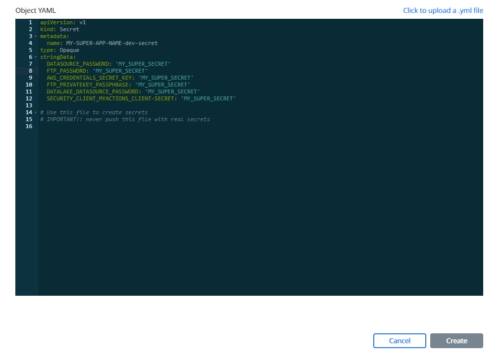

# Secret Managment
## Add secrets through UCP

Since the Secret file **must never be commited**, you can upload it on the UCP.

To do so conect to the [UCP](https://kube9-dev.fr.world.socgen/) then go to the sidebar and click on **Configuration** then on **Create** in the top right corner:

{.img-fluid tag=1}

Once this is done, you should land on the following page:

{.img-fluid tag=1}

There you need to choose the **Namespace** to put your secrets in and past your `secret.yml` file in the box under it. 

!!! tip
    You can also upload your file directly by clicking on `Click to upload a .yml file`

The result shoul look like this:

{.img-fluid tag=1}

Once your finished click on **Create** and your secrets should appear in the configuration tab !
