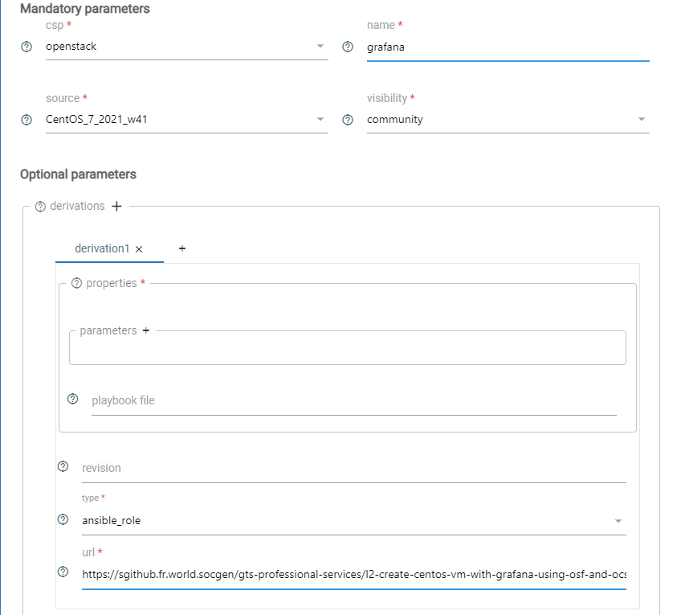
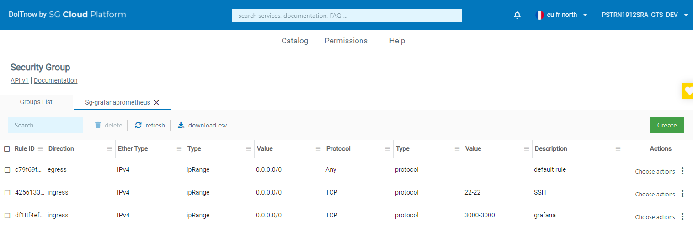

# Create OCS VM
In this section we will show you how to create an OCS VM using DIN.

## Prerequisites.

- An IAM account and an associated role with the following scopes:
    - OSF/OCS
        if you want to create a vm and mount the file system created  
        - [x] `osf:admin`: delete images
        - [x] `osf:read`: list images and get details
        - [x] `osf:write`: create images
        - [x] `ccs:read`: list images, flavors, networks, keypairs and get details about your already created Openstack instances
        - [x] `ccs:write`: create and delete Openstack instances
    - Docker
        - [x] `dockeraas:admin`: Use and manages Docker services

        !!! info
            At the moment you can't see the Docker related permissions in DoItNow, you will have to enable them via WHATS by creating a role with it.    
        
            For more details, go to [Cloud Platform IAM documentation](https://documentation.cloud.socgen/private/products/security/iam/concepts/product_description.html)
  
- Have a valid SSH key pair or keyname if you want SSH to your VM : [Tutorial To Create Your SSH Keypair](https://sgithub.fr.world.socgen/gts-professional-services/l3-bootcamp-prerequesites)
- Have a client id with the same scope as mentioned above  
  A dedicated HandsOn to learn how to setup authorizations and create a client-id is available at: [HandsOn](https://sgithub.fr.world.socgen/gts-professional-services/l2-how-to-set-up-account-authorizations-clientid).

## Steps
 
1. Create an OSF image:
    - Go to [DoItNow](https://go/din) portal
    - Click on 'OS Factory'.
    - Click on the 'create' button
    - Specify the mandatory parameters and add a derivation by clicking on it and choose Ansible role and fill the url field with (see screenshot above)

    {.img-fluid tag=1}
  
2. Create a security group:
    - Go back on DIN home page and select 'Security group' then
    - Click on the 'create' button
    - Create a security group
    - Create 2 rules like described above (allow ingress flow for SSH(22) and http default Grafana port(3000)):  
    
    {.img-fluid tag=1}
  
3. Create an OCS VM from the newly created image:
    - Go back on DIN home page and select 'OCS Virtual Server' then
    - Click on the 'create' button
    - Select the name of the newly created image
    - Fill in among required parameters the name of the newly security group, the [name] of the host  
    - Put your SSH keyname if you want to SSH to the VM
