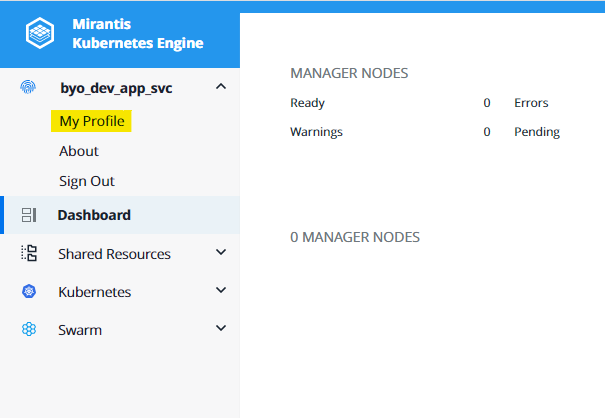
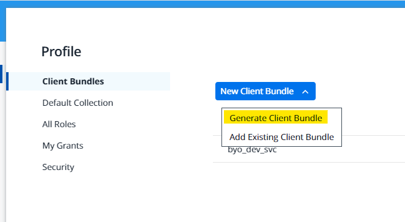
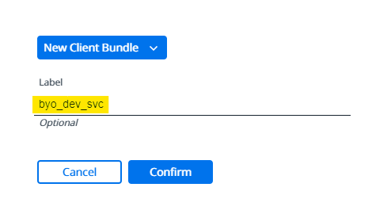
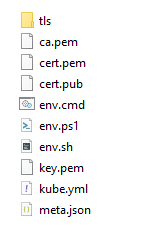
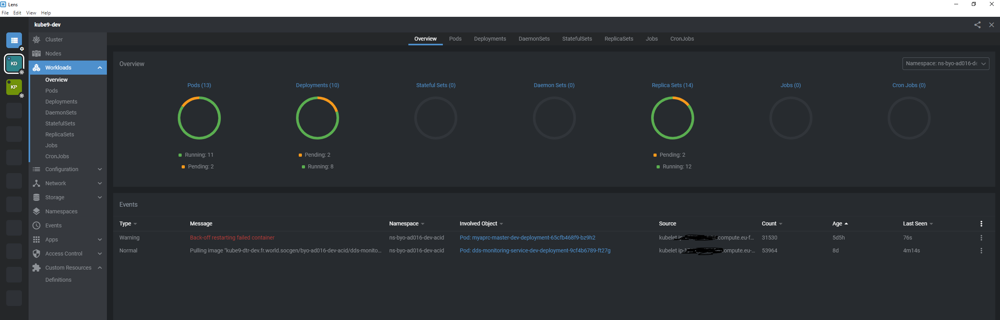

# Lens

Lens is the easiest way to visualize and interact with the Kubernetes cluster without knowing the kubectl commands. Lens features:

- [x] User-friendly UI
- [x] Multi-cluster management
- [x] Standalone application
- [x] Real-time information
- [x] Terminal access to containers
- [x] Much more...

[Official documentation](https://docs.k8slens.dev/main/)

## Prerequisites

* On-board in to at least one of the NS - [Orchestrated Container offer](https://documentation.cloud.socgen/private/products/compute/orchestratedcontainer/index.html)

## Download Assets

- You can go straight to : [k8slens.dev](https://docs.k8slens.dev/main/getting-started/) and download Lens-ide.

!!! tip
    :pushpin: if you don't have access to the external link, you can find the version [5.3.3](https://objs3parlow01.fr.world.socgen:4443/byo-ad016-dev-acid/tools/lens-5.3.3.exe)

- Install it using setup.exe if its windows or rpm if its for linux.
- Connect you to your K8S Cluster using your windows credentials:

1. Click on account name on the top left hand corner and go to **My Profile**.

    {.img-fluid tag=1}

2. Click on **New client bundle** and then choose **Generate client bundle**.

    {.img-fluid tag=1}

3. Enter a label for the bundle and click **Confirm**.

    {.img-fluid tag=1}

4. Unzip the download file, here is it's content:

    {.img-fluid tag=1}

## Connect to your Kubernetes cluster using Lens
Once you have Lens running, connecting to a cluster is easy.

- Click the add cluster button along the left-hand side of the window:

{.img-fluid tag=1}
      
- Copy/Paste the content of kube.yaml:

{.img-fluid tag=1}
      
- Finally, click Add Cluster: 
      
- Lens loads the kubeconfig and displays information about your cluster. Using the left-hand menu and popdowns, you can view arrays of objects and easily drill into their performance and operating characteristics, view logs, even log directly into container shells :

{.img-fluid tag=1}

## 
